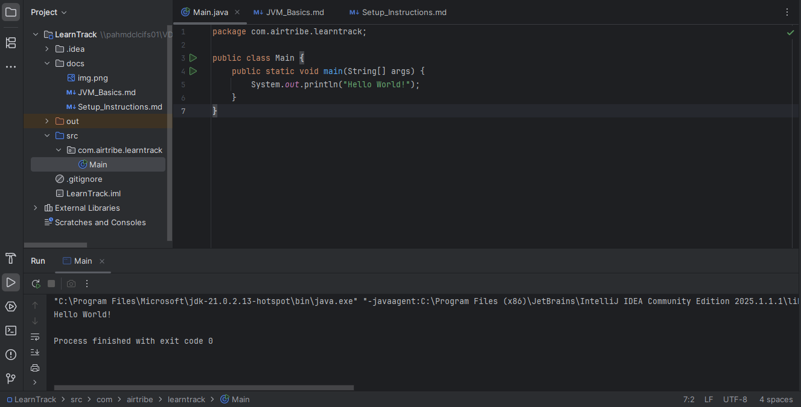

JDK Version: JDK-21.0.2.13

Below is the Hello World Program

public class HelloWorld {
    public static void main(String[] args) {
        System.out.println("Hello World!");
    }
}

The execution of this program gave below output.
Hello World!

